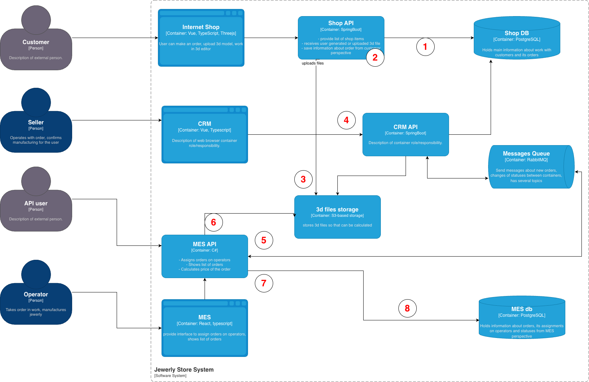
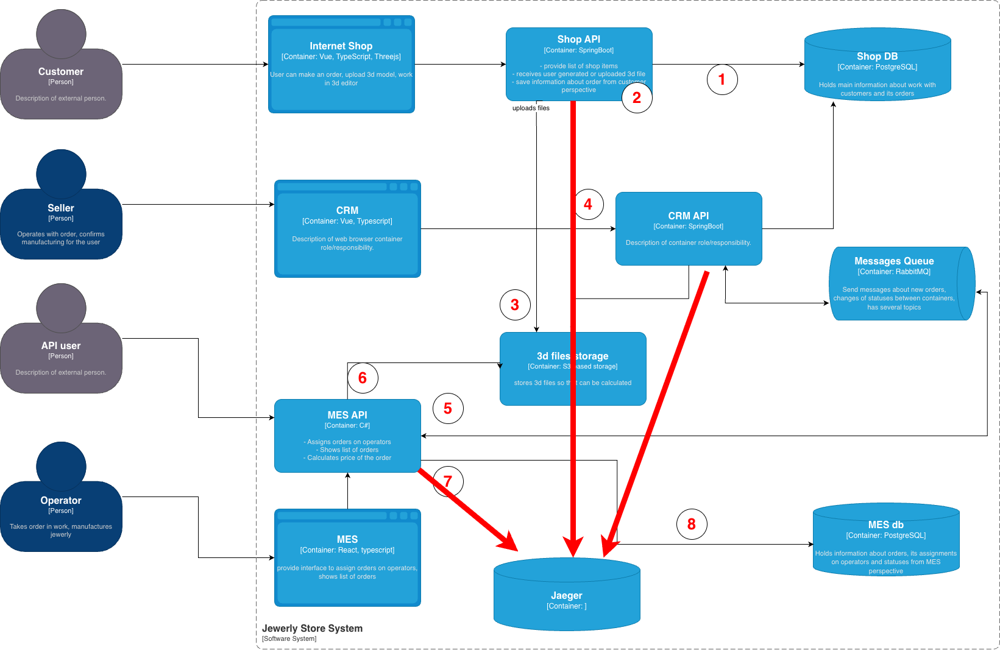
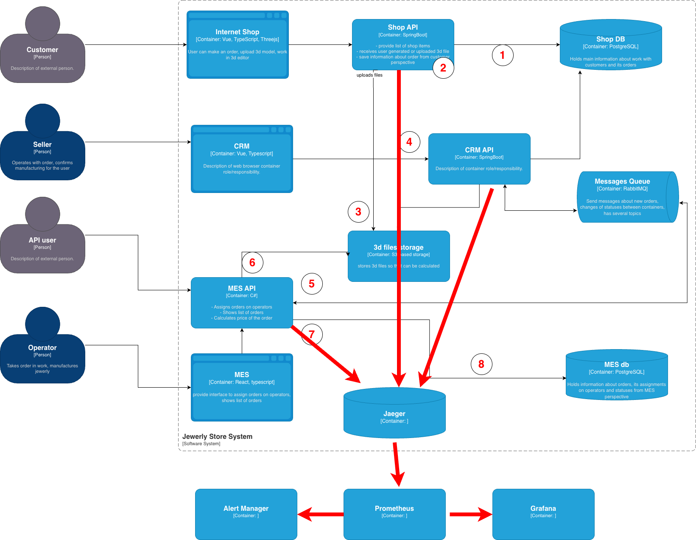

### Возможные точки, в которых заказ может «сломаться» или зависнуть

1. Зависание при поиске товара в интернет-магазине.
2. Сбои на этапе формирования 3D-схемы.
3. Потеря сохранённого файла 3D-схемы.
4. Получение некорректного статуса заказа.
5. Потеря сообщения о создании нового заказа.
6. Несоответствие между статусом заказа и состоянием его 3D-схемы.
7. Утрата событий, связанных с изменением статуса заказа.
8. Зависание запросов, связанных с получением статуса заказа.

### Данные, необходимые в трейсинге

Для полноценного анализа должны фиксироваться:

1. Все запросы к списку товаров и ответы на них.
2. События, связанные с работой пользователя над 3D-схемой, включая результаты операций сохранения.
3. События, влияющие на изменение статуса заказа, а также ответы на запросы статуса.

### Мотивация

Использование трейсинга позволит выявлять первопричины отклонений по ключевым метрикам насыщенности, а также диагностировать инциденты, затрагивающие пользовательский опыт: нарушение сроков исполнения заказов, длительные задержки при получении данных, противоречивую информацию о статусах.

**Мониторинг должен учитывать следующие показатели:**

- Number of dead-letter-exchange letters in RabbitMQ
- Number of messages in flight in RabbitMQ
- Response time (latency) for MES API
- Response time (latency) for CRM API

### Предлагаемое решение

**Внедрение трейсинга**

В компоненты Shop API, CRM API и MES API предлагается встроить SDK OpenTelemetry для передачи контекстов по следующим операциям:

- запросы к каталогу товаров;
- действия над 3D-схемой;
- события жизненного цикла заказа.

Для анализа и визуализации трейсинга разворачивается Jaeger.

**Автоматизация мониторинга на основе трейсинга**

Используемый стек:

- **Jaeger** - сбор и визуализация трейсов (с метриками Prometheus).
- **Prometheus** - сбор метрик от Jaeger.
- **Alertmanager** - генерация и отправка уведомлений.
- **Grafana** (опционально) - визуализация метрик и дашборды.

**Метрики**

- количество заказов в каждом статусе;
- время нахождения заказа в определённом статусе.

**Алерты**

- превышение предельного времени нахождения заказа в конкретном статусе.

**Визуализация**

- самые медленные трейсы;
- средняя скорость обработки заказов и диапазон значений.

### Компромиссы

Если доработка Shop API для внедрения трейсинга окажется слишком трудоёмкой (из-за легаси-архитектуры), можно ограничиться мониторингом. Запросы к каталогу и действия с 3D-редактором не создают сложных распределённых зависимостей и могут наблюдаться без полноценного распределённого трейсинга.

### Аспекты безопасности

Во всех системах уже используются механизмы аутентификации и авторизации. Передача данных трейсинга в Jaeger и доступ пользователей к интерфейсу Jaeger должны использовать эти же механизмы. Дополнительно требуется корректная настройка ролевой модели для ограничения доступа к данным трейсинга.
