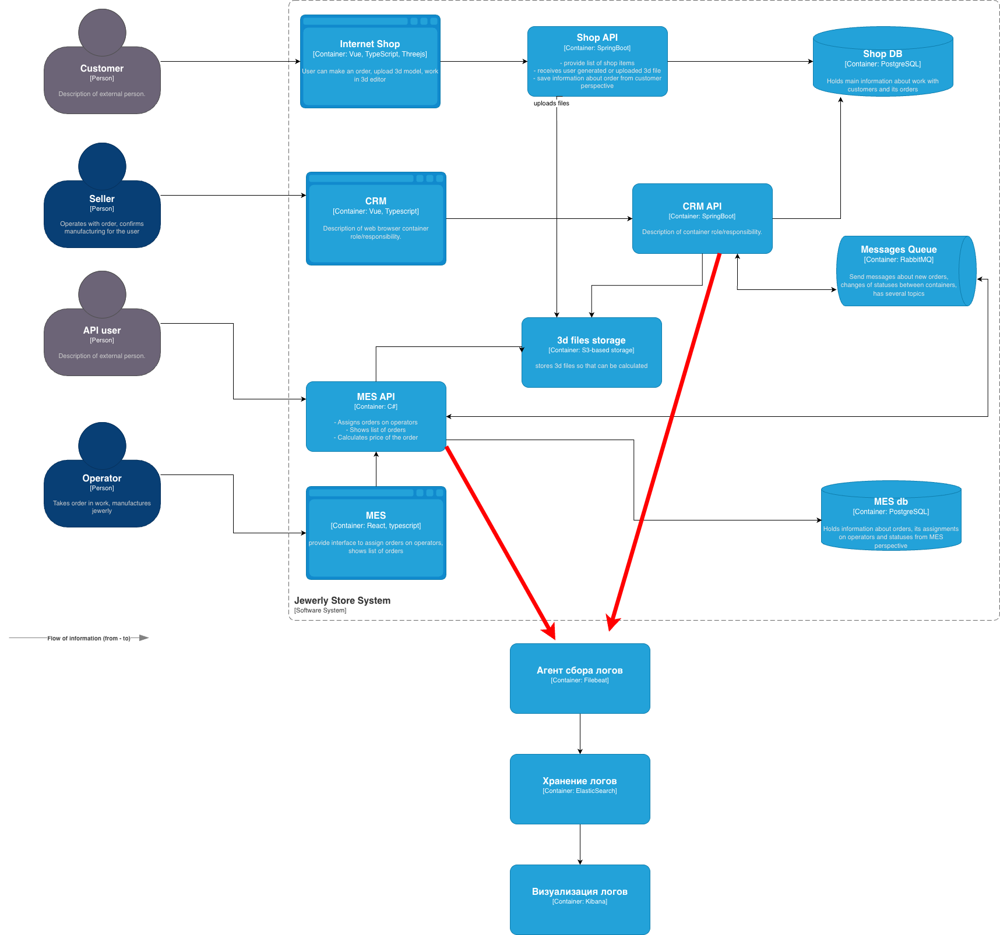

### Список логов

**Shop API:**

- Создан заказ (номер заказа)
- Сохранена 3D-схема (номер заказа, идентификатор и параметры схемы)

**CRM API:**

- Изменился статус заказа (номер заказа, новый статус, детали статуса заказа)

**MES API:**

- Произведён расчёт стоимости (номер заказа, детали расчёта)
- Выполнена работа (номер заказа, детали результата работы)

**Ошибочные ситуации (все сервисы):**

- При возникновении проблем, например:
  - переполнение памяти
  - ошибка обращения к БД
  - иные критические состояния
- Требуется логировать:
  - `ERROR` - если приложение продолжает работу
  - `FATAL` - если требуется аварийный останов

### Мотивация

Логирование необходимо для упреждающего выявления нарушений в работе системы и сокращения сроков диагностики. Логи доступны для анализа сразу и не требуют вмешательства в код, как при использовании отладчика.

**Метрики, которые улучшатся:**

- сократится количество инцидентов, обнаруженных пользователем
- сократится время решения инцидента
- сократится количество заказов с нарушением сроков

Поскольку на текущем этапе наблюдаются труднодиагностируемые проблемы со своевременным исполнением заказов, логирование и трейсинг в первую очередь необходимо внедрить в **CRM API** и **MES API**.

### Предлагаемое решение

- Формирование записей в файл логов реализовать штатными средствами фреймворков.
- Для сбора логов развернуть Filebeat.
  - Logstash не требуется, так как логи простые и не нуждаются в дополнительной обработке.
- Для анализа логов развернуть Elasticsearch + Kibana.

### Безопасность

- Для сбора логов и доступа к Elasticsearch должны использоваться те же механизмы авторизации.
- Необходима дополнительная настройка ролевой модели.
- Чувствительные данные в логах должны заменяться идентификаторами соответствующих объектов.

### Политика хранения логов

**Индексы**

- Shop API - создание заказа, сохранение 3D-схемы
- CRM API - изменение статуса заказа
- MES API - расчёт стоимости заказов
- MES API - выполнение работ
- Логи ошибок сервисов
- Логи ошибок инфраструктурных компонентов

**Настройка ILM**

- rollover по условию max_docs (значение определить эмпирически)
- срок хранения - величина, равная трёхкратной максимальной длительности исполнения заказа
- по окончании срока - перемещение индексов в медленное хранилище
- через год - окончательное удаление
- интервал обновления - 1 час
  - обеспечивает минимальное время реакции на проблемы
  - также должна быть возможность принудительного обновления по запросу

### Мероприятия для трансформации системы сбора логов в систему анализа логов

Поскольку процессы исполнения заказов достаточно медленные, требуется генерация алертов только:

- при фатальных ошибках
- при признаках DDoS-атаки

**Автоматическое выявление аномалий**

Необходимо настроить автоматическое обнаружение следующих ситуаций:

- статус заказа не меняется дольше допустимого интервала
- расчёт стоимости выполняется дольше допустимого интервала
- наличие записей уровня `ERROR`
